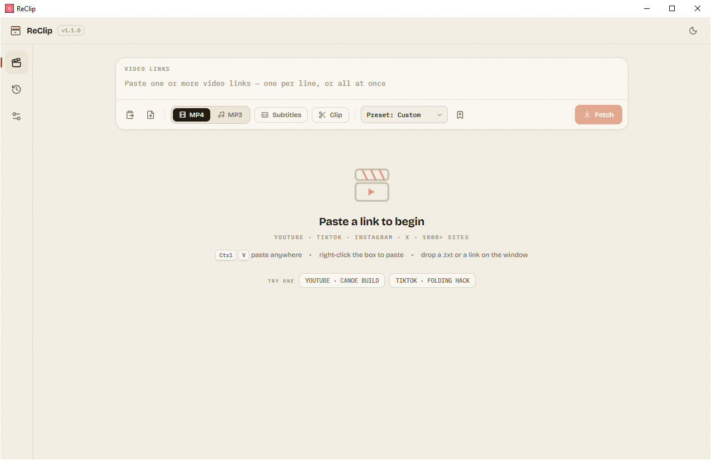

# ReClip

A self-hosted, open-source video and audio downloader with a clean web UI. Paste links from YouTube, TikTok, Instagram, Twitter/X, and 1000+ other sites — download as MP4 or MP3.




## Desktop App

**Version 1.1.0** — A standalone desktop app for Windows. Download from [GitHub Releases](https://github.com/bugsfreeWeb/Reclip/releases):

- **`ReClip_win64_v1.1.0_Setup.exe`** — Windows installer (installs to `%LOCALAPPDATA%\BugsfreeStudio\ReClip` with shortcuts)
- **`ReClip_win64_v1.1.0.exe`** — Portable single-file exe (no installation needed)

Both include yt-dlp and ffmpeg built in. Double-click `ReClip.bat` to build from source.

## Features

- Download videos from 1000+ supported sites (via [yt-dlp](https://github.com/yt-dlp/yt-dlp))
- MP4 video or MP3 audio extraction
- Quality/resolution picker
- Bulk downloads — paste multiple URLs at once
- Automatic URL deduplication
- Clean, responsive UI — no frameworks, no build step
- Single Python file backend (~150 lines)
- Animated splash screen with ReClip branding
- Download progress bar with speed and ETA
- Save file dialog — choose where to save after download
- Watch/preview downloaded files before saving
- Download history with re-download and clear options
- Settings panel (save location, history toggle)
- Right-click paste on URL input
- Batch import from file — load URLs from a .txt file
- Auto-subtitle download — fetch SRT/VTT subtitles alongside video
- Trim/clip download — download only a time range (e.g. 0:30–2:00)
- Format presets — save preferred quality/format combos
- Duplicate detection — warn if URL already in history
- Dark/light theme toggle — switch between warm beige and dark mode
- **Update checker** — check and update yt-dlp engine from settings
- **Parallel downloads** — download multiple videos simultaneously

## Quick Start

### Desktop App (Windows)

```bash
git clone https://github.com/bugsfreeWeb/Reclip.git
cd Reclip
./ReClip.bat
```

The first run will build `dist\ReClip.exe` automatically.

### Web App

```bash
brew install yt-dlp ffmpeg    # or apt install ffmpeg && pip install yt-dlp
git clone https://github.com/bugsfreeWeb/Reclip.git
cd Reclip
./reclip.sh
```

Open **http://localhost:8899**.

Or with Docker:

```bash
docker build -t reclip . && docker run -p 8899:8899 reclip
```

## Usage

1. Paste one or more video URLs into the input box (or import from a .txt file)
2. Choose **MP4** (video) or **MP3** (audio)
3. Optionally enable **Subtitles** and/or **Clip** (set start/end time)
4. Click **Fetch** to load video info and thumbnails
5. Select quality/resolution if available
6. Click **Download** on individual videos, or **Download All**
7. After download, click **Save** to choose where to save the file
8. Click **Watch** to preview the downloaded file

## Supported Sites

Anything [yt-dlp supports](https://github.com/yt-dlp/yt-dlp/blob/master/supportedsites.md), including:

YouTube, TikTok, Instagram, Twitter/X, Reddit, Facebook, Vimeo, Twitch, Dailymotion, SoundCloud, Loom, Streamable, Pinterest, Tumblr, Threads, LinkedIn, and many more.

## Stack

- **Backend:** Python + Flask (~150 lines)
- **Frontend:** Vanilla HTML/CSS/JS (single file, no build step)
- **Desktop:** PyInstaller + pywebview (single-file exe)
- **Download engine:** [yt-dlp](https://github.com/yt-dlp/yt-dlp) + [ffmpeg](https://ffmpeg.org/)
- **Dependencies:** Flask, yt-dlp, imageio-ffmpeg, pywebview

## Building the Desktop App

```bash
pip install flask yt-dlp imageio-ffmpeg pywebview pyinstaller
python -m PyInstaller --onefile --windowed --name "ReClip" \
    --add-data "templates;templates" \
    --add-data "static;static" \
    --add-data "tools;tools" \
    --add-data "app.py;." \
    --add-data "desktop.py;." \
    --hidden-import yt_dlp \
    --hidden-import imageio_ffmpeg \
    --hidden-import webview \
    desktop.py
```

Output: `dist\ReClip.exe`

## Credits

Project: ReClip (Inspired project) — Organized by **Bugsfree Studio**

Based on [averygan/reclip](https://github.com/averygan/reclip)

## Disclaimer

This tool is intended for personal use only. Please respect copyright laws and the terms of service of the platforms you download from. The developers are not responsible for any misuse of this tool.

## License

[MIT](LICENSE)
